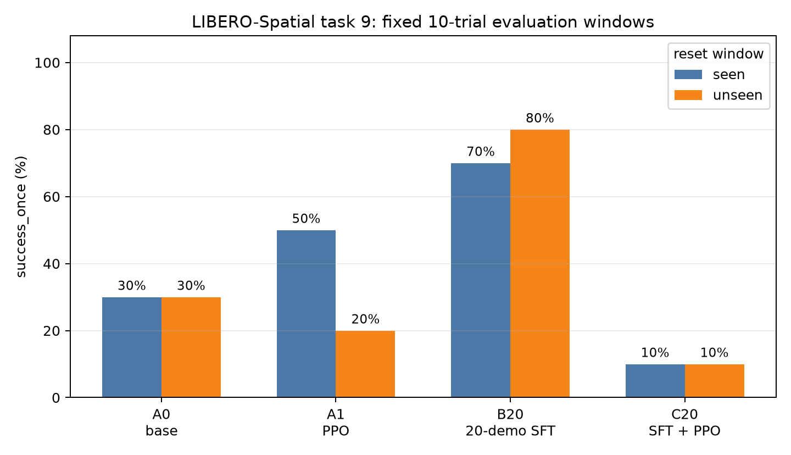

# π0.5 × LIBERO-Spatial：SFT 与 PPO 在线后训练消融

> 一个围绕 **π0.5 机器人 VLA** 的可复现实验：在同一个困难的 LIBERO-Spatial 操作任务上，拆分并比较专项少样本 SFT 与在线 PPO 后训练的实际贡献。


## 30 秒了解项目

**问题。** 专项示范微调（SFT）和在线强化学习（PPO）能否稳定提升 π0.5 的机器人操作成功率？

**任务。** LIBERO-Spatial task 9：

> `pick up the black bowl on the wooden cabinet and place it on the plate`

即让机械臂把木柜上的黑碗放到盘子上。

**方法。** 先用统一协议筛查 10 个 Spatial task；task 9 的基础 π0.5 成功率最低（3/10），因此在训练前确定为主实验。随后设计 2×2 消融：是否进行 20 条专项示范 SFT、是否进行 10 epoch 在线 PPO。

**结论。** 严格任务匹配的 20 条示范 SFT 是最稳定的提升来源；当前小样本 PPO 配置没有与 SFT 叠加增益，反而导致策略退化。该结论只针对这个单任务、固定预算与小样本评测协议，不外推为 PPO 的普遍结论。

## 核心结果

每个结果来自两个互不重叠的 reset-state 窗口（`0–9`、`10–19`），每个窗口各 10 条轨迹、每条最多 240 个环境步。主指标为 `success_once`：轨迹中任意时刻是否完成任务。

| 组别 | 训练方式 | Seen：0–9 | Unseen：10–19 |
| --- | --- | ---: | ---: |
| A0 | 公开 π0.5 LIBERO SFT 基线 | 30%（3/10） | 30%（3/10） |
| A1 | A0 + PPO | 50%（5/10） | 20%（2/10） |
| **B20** | **A0 + 20-demo SFT** | **70%（7/10）** | **80%（8/10）** |
| C20 | B20 + PPO | 10%（1/10） | 10%（1/10） |



`seen/unseen` 指的是两组互不重叠的**初始状态窗口**，不是不同任务，更不是跨任务或真实世界泛化结论。完整的指标（含 `success_at_end` 与 reward）见 [results/task9_ablation.csv](results/task9_ablation.csv)。

## 为什么这个实验可信

- **先选任务，后训练。** 同一 checkpoint、同一 10-trial 协议筛查全部 10 个 Spatial task；task 9 为最低且未饱和结果。完整筛查表在 [results/spatial_seen_diagnostic.csv](results/spatial_seen_diagnostic.csv)。
- **修复数据编号陷阱。** LIBERO-Spatial 的 10-task 编号不能直接映射到公开演示集的 40-task 编号。脚本先读取 benchmark 的自然语言指令，再精确匹配演示数据；task 9 的正确 aggregate dataset index 是 39。
- **固定且透明的对照。** A0、A1、B20、C20 的初始化、训练预算与评测窗口均固定；C20 的负向结果被保留，而非只展示成功视频或训练中间指标。
- **指标与视频分工明确。** 视频只用于定性理解；正式结论来自两个独立窗口、每组共 20 条轨迹的汇总指标。

## 两段建议观看的视频

| 视频 | 用途 |
| --- | --- |
| [同一 reset 的 A0 vs B20 对照](assets/videos/task9_bowl/comparison_a0_vs_b20_same_reset.mp4) | 同一 reset 3：左侧 A0 未完成，右侧 B20 完成。 |
| [B20 的未见窗口成功轨迹](assets/videos/task9_bowl/b20_unseen_success_slow.mp4) | reset 12 的单条成功 rollout，用于补充理解 B20 行为。 |

视频均放慢至原速度约 1/3，便于观察抓取、移动和放置过程。详细说明见 [assets/videos/task9_bowl/README.md](assets/videos/task9_bowl/README.md)。

## 复现路径

### 环境前提

- 一个已配置的 [RLinf](https://github.com/RLinf/RLinf) checkout，含 OpenPI π0.5 与 LIBERO/MuJoCo 依赖；
- Python 3.10+；
- 可访问 Hugging Face 的网络。若使用镜像，可在运行前覆盖 `HF_ENDPOINT`；
- 用于 SFT/PPO 的 GPU。项目实际以 4090 24GB 完成环境调试，以 A800 80GB 完成正式训练与评测；PPO 同时运行 8 个环境，吞吐主要受 MuJoCo CPU 仿真约束。

```bash
git clone https://github.com/kk80192058-sketch/pi05-libero-spatial-rl-ablation.git
cd pi05-libero-spatial-rl-ablation

export RLINF_DIR=/path/to/RLinf
export PROJECT_DIR=$PWD
export MUJOCO_GL=osmesa
export PYOPENGL_PLATFORM=osmesa
# 可选：export HF_ENDPOINT=https://hf-mirror.com
```

### 1. 评测指定 task 与固定 reset 窗口

第一次运行时，脚本会应用一个很小的 RLinf 补丁，为评测增加 `eval_reset_start_idx`。它只控制从第几个有序 reset state 开始，不修改任务、奖励或模型。

```bash
MODEL_PATH=/path/to/RLinf-Pi05-LIBERO-SFT \
TASK_ID=9 RESET_START=0 NUM_ENVS=10 \
OUTPUT_DIR=/path/to/results/task9_a0_seen \
bash scripts/run_libero_task_window_eval.sh
```

将 `RESET_START` 改为 `10` 即可评测独立的第二窗口。

### 2. 构建严格匹配的 20-demo 训练集

```bash
python scripts/download_libero_spatial_task_demos.py \
  --task-id 9 --output /path/to/libero_spatial_task9_all

python scripts/build_libero_task_sft_subset.py \
  --source /path/to/libero_spatial_task9_all \
  --output /path/to/libero_spatial_task9_train20 \
  --train-count 20 --seed 42
```

生成的 `split.csv` 记录固定 train / holdout 划分。44 条可用演示中，20 条用于 SFT，24 条不参与训练。

### 3. 运行 B20：20-demo SFT

```bash
MODEL_PATH=/path/to/RLinf-Pi05-LIBERO-SFT \
DATA_PATH=/path/to/libero_spatial_task9_train20 \
OUTPUT_DIR=/path/to/task9_sft20 EXPERIMENT_NAME=task9_sft20 \
bash scripts/run_libero_task_sft20.sh
```

默认 SFT 配方为：500 steps、batch size 8、learning rate `5e-6`、seed 42。

### 4. 运行 A1 或 C20：PPO 后训练

```bash
MODEL_PATH=/path/to/policy_or_sft_checkpoint_actor \
OUTPUT_DIR=/path/to/task9_ppo TASK_ID=9 \
EXPERIMENT_NAME=task9_pi05_ppo MAX_EPOCHS=10 TRAIN_ENVS=8 \
bash scripts/run_libero_task_ppo.sh
```

完成后用第 1 步分别评测 `RESET_START=0` 和 `RESET_START=10`，再汇总和绘图：

```bash
python scripts/collect_task9_ablation.py --output results/task9_ablation.csv \
  A0_seen=/path/to/a0_seen.log A0_unseen=/path/to/a0_unseen.log \
  A1_seen=/path/to/a1_seen.log A1_unseen=/path/to/a1_unseen.log \
  B20_seen=/path/to/b20_seen.log B20_unseen=/path/to/b20_unseen.log \
  C20_seen=/path/to/c20_seen.log C20_unseen=/path/to/c20_unseen.log

python scripts/plot_task9_ablation.py \
  --input results/task9_ablation.csv \
  --output assets/figures/task9_ablation_success_rate.png
```

## 仓库导航

```text
assets/figures/     最终消融图
assets/videos/      两段定性展示视频
configs/            固定的 20-demo SFT 配方
docs/               最终实验报告
patches/            RLinf 的最小 reset-window 评测补丁
results/            可审阅的最终指标 CSV
scripts/            数据映射、SFT、PPO、评测、汇总与绘图脚本
```

- 想先看实验叙述与限制：阅读 [最终实验报告](docs/task9_final_report.md)。
- 想检查数据映射：阅读 [下载与文本匹配脚本](scripts/download_libero_spatial_task_demos.py)。
- 想复查评测窗口实现：阅读 [reset-window 补丁](patches/rlinf_eval_reset_offset.patch)。

## 范围与限制

- 这是一个经过预筛选的**单任务**实验，而不是全 LIBERO 平均成绩；
- 每个窗口只有 10 条轨迹，所有百分比均同时保留 `n/10`；
- 仿真成功不等于真机成功；
- 训练数据、模型 checkpoint、原始日志与临时视频体积较大，且可能包含环境相关路径，因此未提交。仓库保留了生成这些产物的脚本、最终小型结果表、图和两段展示视频；
- 本仓库代码以 [MIT License](LICENSE) 发布；第三方框架、模型、数据集分别遵循其自身许可证。
